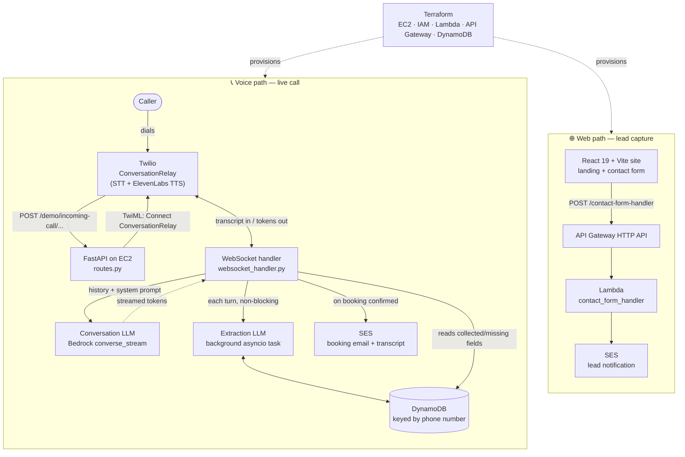

# PeakFlow

**An AI voice receptionist that answers the phone, qualifies the caller, and books the appointment — 24/7, over a real phone line.**


### 📞 Try it live: **[315-556-8316](tel:3155568316)**

Call the number and you'll be talking to the system in this repository. It will greet you as the receptionist for a roofing company, ask for your name and address, work out whether you need a repair or a replacement, negotiate a date and time inside the business's hours, and confirm the booking — then email the transcript and the structured appointment record to the business owner.

Backend live at `server.connerdefeo.com` · deployed on AWS · built solo.

---

## What it does

Home-services businesses (roofing, HVAC, plumbing) lose real revenue to missed calls — the crew is on a roof, the phone rings, the lead calls the next company on the list. PeakFlow puts a voice agent on that line.

The hard part isn't generating text. It's holding a **live phone conversation** where every extra 300ms of latency is audible dead air, while simultaneously pulling reliable structured data out of a rambling human so the booking can actually be written to a database. This repo solves both, plus the infrastructure to run it and the marketing site that sells it.

I designed and built the whole thing: the real-time voice pipeline, the LLM orchestration, the AWS infrastructure as code, and the frontend.

## Architecture



## Engineering highlights

Each of these was a decision with a tradeoff, not a default.

**Token streaming instead of request/response.** The conversation model is called with Bedrock's `converse_stream`, and each token is forwarded to Twilio the instant it arrives rather than waiting for a complete reply. Twilio's TTS starts speaking off the first tokens, so the caller hears a response beginning in a few hundred milliseconds instead of after a full generation. On a phone call this is the difference between a conversation and an interrogation.

**Two-pass LLM design, with the second pass off the critical path.** One model call talks to the caller; a *separate* call turns each turn into structured JSON (`extraction.py`). Asking a single call to do both would either slow down speech or produce muddy conversational output. The extraction pass is dispatched with `asyncio.create_task`, so it writes to DynamoDB while the caller is already hearing the next question — it never adds latency to the voice path.

**Conversation state lives in DynamoDB, keyed by caller phone number.** The system prompt is rebuilt each turn from a diff of `collected` vs `missing` fields (`conversation.py`), which steers the model to ask for exactly what's still needed rather than trusting it to track progress across a long context. Because state is keyed on the phone number with a TTL, a caller who hangs up halfway through resumes where they left off when they call back.

**Multi-tenant from one deployment.** A `Client` enum routes prompt templates, DynamoDB tables, TTS voices, and completion sentinels, while per-business specifics — company name, owner, opening hours, days open, founding year — arrive as URL path parameters on the Twilio webhook and are injected into the prompt via `format_map`. Onboarding a new business is a new Twilio number pointed at a new path, not a new server.

**Deterministic call termination.** LLMs don't reliably know when they're finished, so the prompt requires an exact sentinel phrase as the final goodbye. The handler matches it, waits a speak-time interval derived from the reply's word count (~150 wpm) so the caller actually hears the farewell, *then* closes the socket and fires the SES notification. Simple, and it avoids both hanging up mid-sentence and leaving dead air.

**Infrastructure fully described in Terraform.** EC2 + Elastic IP + security group, scoped IAM roles for Bedrock/DynamoDB/SES, both Lambdas packaged with `archive_file` and redeployed on `source_code_hash` change, an API Gateway HTTP API with CORS, and the DynamoDB tables — all `for_each`-driven so adding a function or a tenant table is a one-line change.

## Tech stack

| Layer | Technology |
| --- | --- |
| **Voice / telephony** | Twilio Programmable Voice, ConversationRelay, ElevenLabs TTS |
| **Backend** | Python, FastAPI, Uvicorn, WebSockets, `asyncio` |
| **AI** | AWS Bedrock — Claude Haiku 4.5 (cross-region inference profile), streaming + structured extraction |
| **Data** | DynamoDB (on-demand billing, TTL expiry) |
| **Email** | AWS SES |
| **Infrastructure** | Terraform ≥ 1.12, AWS provider ~> 5.0, EC2, Lambda (Python 3.12), API Gateway HTTP API, IAM |
| **Frontend** | React 19, TypeScript 6, Vite 8, Tailwind CSS 4, React Router 7 |

## Repository layout

```
├── server/                     # FastAPI voice application (runs on EC2)
│   ├── main.py                 # App entrypoint + logging setup
│   ├── routes.py               # Twilio webhooks & WebSocket routes per tenant
│   ├── incoming_call_handler.py# Builds TwiML <Connect><ConversationRelay>
│   ├── websocket_handler.py    # Live call loop: stream, extract, book, notify
│   ├── conversation.py         # Prompt assembly + Bedrock streaming
│   ├── extraction.py           # Second-pass turn → structured JSON
│   ├── dynamo.py               # Appointment state read/write
│   ├── email_service.py        # SES booking notification w/ transcript
│   └── config.py               # Clients, prompt templates, AWS resources
├── lambda/
│   ├── contact_form_handler.py # Website lead form → SES
│   └── auto_email_send.py      # Standalone send endpoint
├── terraform/                  # All AWS infrastructure
│   ├── ec2.tf                  # Instance, EIP, security group, IAM role
│   ├── lambda.tf               # Lambdas, API Gateway, routes, function URLs
│   ├── dynamo.tf               # Appointment tables
│   └── provider.tf
├── client/                     # Marketing site (React + Vite + Tailwind)
│   └── src/pages/              # Landing sections, contact form
├── email-sender/               # Minimal React harness for the SES Lambda
├── index.html                  # Standalone SMS demo landing page
└── deploy.sh                   # terraform apply wrapper
```

## Running it locally

**Prerequisites:** Python 3.11+, Node 20+, Terraform ≥ 1.12, an AWS account with Bedrock model access enabled in `us-east-2` and a verified SES identity, a Twilio number, and a tunnel (ngrok/Cloudflare) — Twilio must be able to reach your machine over `wss://`.

**1 — Provision AWS resources**

```bash
cd terraform
terraform init
terraform apply          # or: ./deploy.sh
```

This creates the DynamoDB tables the server expects, the Lambdas, and the API Gateway endpoints (printed as outputs).

**2 — Run the voice server**

```bash
cd server
python -m venv .venv && source .venv/bin/activate
pip install -r requirements.txt
uvicorn main:app --host 0.0.0.0 --port 8000
```

Your AWS credentials need `bedrock:InvokeModel*`, `dynamodb:GetItem/PutItem`, and `ses:SendEmail` — the same permissions granted to the EC2 instance role in `terraform/ec2.tf`.

**3 — Point Twilio at it**

Expose port 8000 publicly, set `SERVER_DOMAIN` in `server/config.py` to that hostname, and configure your Twilio number's incoming-voice webhook to `POST`:

```
https://<your-domain>/demo/incoming-call/Summit_Roofing/Dave/9:00AM/5:00PM/Monday-Friday/2011
                                         └ company ──┘ └owner┘ └ open ┘ └ close┘ └── days ──┘ └year┘
```

Underscores become spaces, so `Summit_Roofing` reaches the prompt as "Summit Roofing". Then call the number. Use `/personal/incoming-call` for the open-ended conversational agent with no booking flow.

**4 — Run the frontend**

```bash
cd client
npm install
echo "VITE_EMAIL_API_URL=<contact-form endpoint from terraform output>" > .env
npm run dev
```

## Configuration

| Setting | Location | Purpose |
| --- | --- | --- |
| `SERVER_DOMAIN` | `server/config.py` | Public hostname Twilio opens the `wss://` connection to |
| `CONVERSATION_MODEL` | `server/config.py` | Bedrock model ID used for both conversation and extraction |
| `MAX_OUTPUT_TOKENS` | `server/config.py` | Reply cap — kept low (200) to keep spoken turns short |
| `CONVERSATION_TEMPLATES` | `server/config.py` | Per-tenant system prompts and booking field schemas |
| AWS region | `server/config.py`, `terraform/provider.tf` | `us-east-2` throughout |
| `VITE_EMAIL_API_URL` | `client/.env` | API Gateway endpoint for the contact form |
| `DEMO_NUMBER` | `client/src/constants/demo.ts` | Demo line shown on the site |

## Known limitations & roadmap

Honest state of the project — it's a working product, not a hardened one.

- **No automated test suite or CI.** The voice path is currently validated by calling it. Highest-value next step: unit tests around prompt assembly and extraction parsing, plus a fake Twilio WebSocket client to exercise the call loop in CI.
- **Single-instance deploy.** One `t3.small` behind an Elastic IP, with server code updated by hand; `deploy.sh` only wraps `terraform apply`. Next: containerize, put it behind a load balancer with health checks, and wire up a deploy pipeline.
- **Tenant config travels in the URL.** Fine for demos and a handful of clients, but business settings belong in DynamoDB behind a tenant ID rather than in a path with seven segments.
- **Demo-grade access controls.** SSH is open to `0.0.0.0/0` and the Lambda function URLs are unauthenticated. Both need locking down before this carries real customer volume.
- **Extraction failures are logged and swallowed.** A dropped extraction silently loses a field for that turn; it needs a retry with backoff and a dead-letter path.
- **Calendar write-back is unbuilt.** Google API client libraries are already in `requirements.txt` for it — bookings currently land in DynamoDB and an email, not directly on the owner's calendar.
